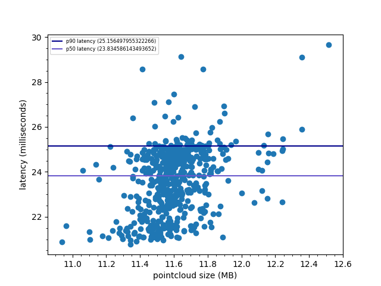

# ga-opencv-python
GPU Accelerated (using CuPy) Computer Vision functions that mimic the OpenCV API.

# Functions

**⚠ Work In Progress ⚠**

This is a personal project, and OpenCV functions will be built out as-needed.

- **[projectPoints](https://docs.opencv.org/3.4/d9/d0c/group__calib3d.html#ga1019495a2c8d1743ed5cc23fa0daff8c)**:
Function for [Projecting 3D points to image plane](https://docs.opencv.org/2.4/modules/calib3d/doc/camera_calibration_and_3d_reconstruction.html).

This graph shows p90 latency for aligning pointclouds roughly 11.5MB in size to be 25.16ms. This operation would take an order of magnitude more if performed on the CPU using OpenCV. **TODO: More detailed look at latency comparison between OpenCV + CPU and this library**



# Running Tests
Running single test files directly:
```
cd $REPOSITORY_ROOT
python -m unittest tests/test_calib3d.py
```
Helper script to run all test files:
```
python -m runtests
```
